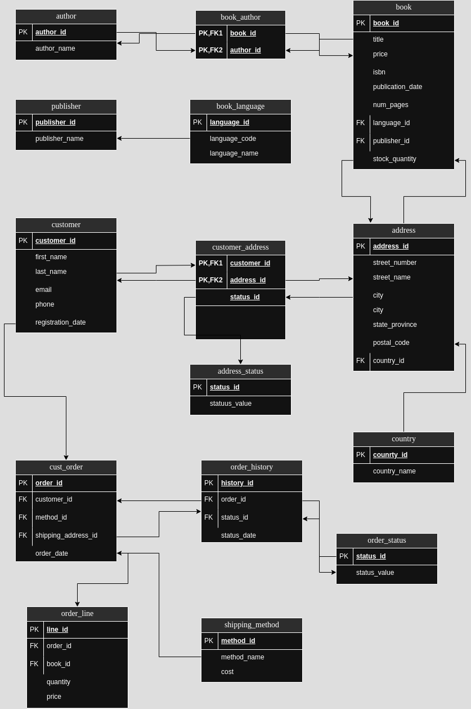

# Database Design & Programming with SQL

## Overview

In this project, you'll step into the role of a database administrator tasked with building a  MySQL database to store and manage data for a BookStore. By applying your skills in database design, table creation, data loading, and user management, you'll develop an organized system for this important real-world system.
This hands-on project provides valuable experience in efficiently structuring databases to handle large, complex data.

## Tools and Technologies

MySQL - For building and managing the database
Draw.io - For visualizing the database schema and relationships

## Prerequisites

To successfully complete this project, you should be comfortable with:
Understanding the basics of MySQL
Creating tables in MySQL with the appropriate data types
Managing MySQL users and applying security best practices

## Project Objective

Your goal is to build a relational database that stores information about the bookstore's operations, including books, authors, customers, orders, shipping, and more. You will create a database that efficiently stores all necessary data and allows for quick retrieval and analysis.

## Step-by-Step Instructions

Create a new database to store bookstore data.
Determine the table schema and data types
Write the SQL commands to create tables that match the data structure
Set up user groups and roles to control access to the database
Test the database by running queries to retrieve and analyze the data

## Expected Outcomes

By completing this SQL project, you'll gain practical experience and valuable, transferable skills, including:
Designing and implementing a MySQL database for a real-world use case
Creating tables with the optimal schema and data types for the dataset
Managing database access through user groups and roles to ensure security
Querying the data to extract meaningful insights

## Tables to Be Created

Here are the key tables that you'll design and implement for the bookstore database:

- book: A list of all books available in the store.
- book_author: A table to manage the many-to-many relationship between books and authors.
- author: A list of all authors.
- book_language: A list of the possible languages of books.
- publisher: A list of publishers for books.
- Customer: A list of the bookstore's customers.
- customer_address: A list of addresses for customers. Each customer can have multiple addresses.
- address_status: A list of statuses for an address (e.g., current, old).
- address: A list of all addresses in the system.
- country: A list of countries where the addresses are located.
- cust_order: A list of orders placed by customers.
- order_line: A list of books that are part of each order.
- shipping_method: A list of possible shipping methods for an order.
- order_history: A record of the history of an order (e.g., ordered, cancelled, delivered).
- order_status: A list of possible statuses for an order (e.g., pending, shipped, delivered).

## Entity Relationship Diagram(ERD)

